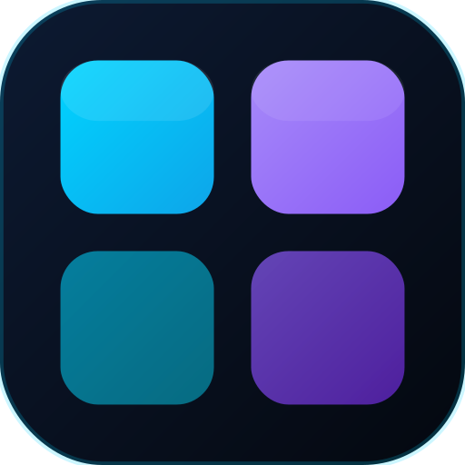
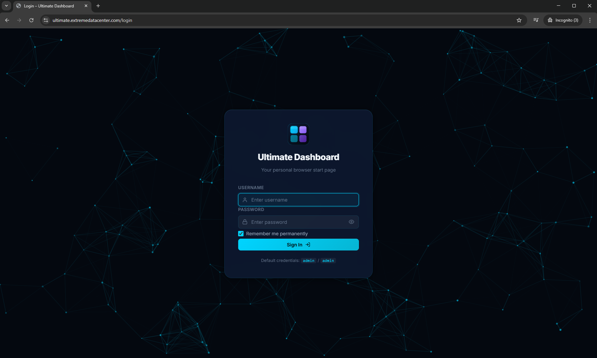
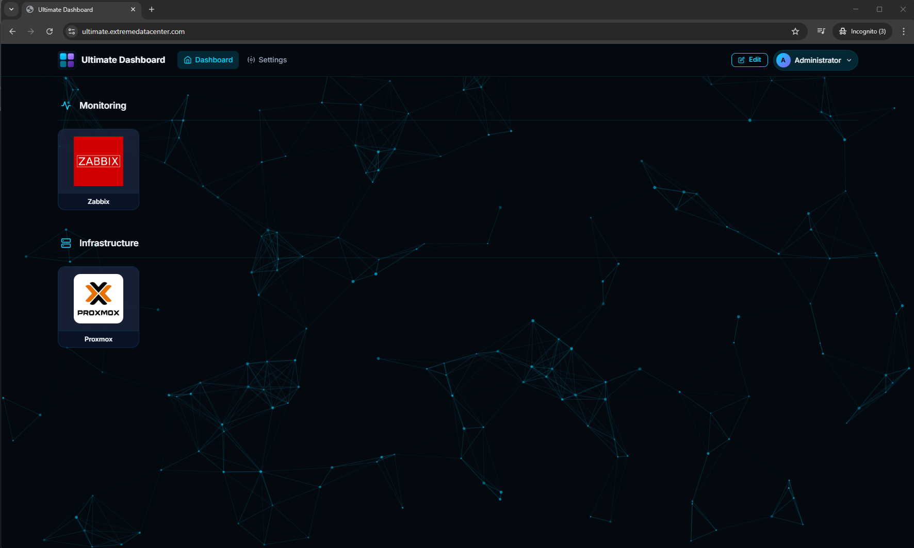

<div align="center">
  
  <h1>Ultimate Dashboard</h1>
  <p><strong>A self-hosted browser start-page dashboard - dark theme, tile-based, Docker-native.</strong></p>
  <p>
    <a href="#-quick-start">Quick Start</a> ·
    <a href="#-features">Features</a> ·
    <a href="#-docker-hub">Docker Hub</a> ·
    <a href="#%EF%B8%8F-configuration">Configuration</a> ·
    <a href="#-traefik--https">Traefik & HTTPS</a> ·
    <a href="#-screenshots">Screenshots</a> ·
    <a href="#-changelog">Changelog</a>
  </p>
  <p>
    <a href="https://hub.docker.com/r/extremedatacenter/ultimatedashboard">
      
    </a>
    <a href="https://hub.docker.com/r/extremedatacenter/ultimatedashboard/tags">
      
    </a>
    
    
    
    
    
  </p>
</div>

---

## ✨ Features

- **Tile-based layout** - organise shortcuts into named groups, each with a custom icon
- **Icon library** - browse 500+ built-in SVG logos for popular IT products; admins can download the latest set from GitHub
- **Custom logos** - upload any image (PNG, JPG, SVG, ICO, WebP) or auto-fetch a favicon
- **Logo fills the tile** - uploaded images fill the entire upper portion of each card
- **Edit mode** - add, edit, delete, and drag-to-reorder tiles without leaving the page; press `E` to toggle
- **Permanent login** - remember-me cookie keeps you signed in for a year (ideal as a browser start page)
- **Dark theme** - cyan / purple palette with an animated particle-network canvas background
- **Multi-user** - admin and user roles, user management in Settings
- **Customisable** - set your own app name and logo via the Settings page
- **Zero external database** - SQLite, single file, no extra services needed
- **Docker-native** - PHP 8.2 + Apache in one container, pre-built image on Docker Hub
- **Automatic HTTPS** - Traefik v3 with Cloudflare DNS-01 Let's Encrypt certificates

---

## 🐳 Docker Hub

The image is published at:
**[hub.docker.com/r/extremedatacenter/ultimatedashboard](https://hub.docker.com/r/extremedatacenter/ultimatedashboard)**

| Tag | Description |
|---|---|
| `latest` | Always points to the latest stable release |

**Pull the image:**

```bash
docker pull extremedatacenter/ultimatedashboard:latest
```

**Run without Traefik (HTTP, local use):**

```yaml
# docker-compose.yml
services:
  ultimate-dashboard:
    image: extremedatacenter/ultimatedashboard:latest
    restart: unless-stopped
    ports:
      - "8080:80"
    volumes:
      - ./data:/data
      - ./uploads:/var/www/html/uploads/logos
```

```bash
mkdir -p data uploads && docker compose up -d
```

Open `http://localhost:8080` - default credentials: `admin` / `admin`

---

## 🚀 Quick Start

> **Want the pre-built image instead of building from source?** See the [Docker Hub](#-docker-hub) section above.
> Adjust traefik compose file to get certificate from http, but the portal is intendend for internal use and to be secure behind an VPN etc.

### Prerequisites

| Requirement | Notes |
|---|---|
| Docker & Docker Compose | v2.x or later |
| A domain | DNS managed by Cloudflare (for automatic HTTPS) |
| Cloudflare API token | Zone → DNS → Edit permissions |

 

### Deploy in 3 steps

**1. Clone the repository**

```bash
git clone https://github.com/Marcel-Balk/UltimateDashboard.git
cd UltimateDashboard
```

**2. Configure your environment**

```bash
cp .env.example .env
```

Edit `.env`:

```dotenv
CF_DNS_API_TOKEN=your_cloudflare_dns_api_token
ACME_EMAIL=you@example.com
APP_DOMAIN=dashboard.yourdomain.com
```

> **Tip:** Create a Cloudflare API token at `My Profile → API Tokens → Create Token` using the *Edit zone DNS* template.

**3. Start the stack**

```bash
# Create the acme.json file with correct permissions before first start
mkdir -p data && touch data/acme.json && chmod 600 data/acme.json

docker compose up -d
```

Open `https://dashboard.yourdomain.com` - the Let's Encrypt certificate is issued automatically via DNS-01.

> **Default credentials:** `admin` / `admin` - **change this immediately** in Settings → Change Password.

---

## First Time installing docker?
1. Download Debian 13 from: https://cdimage.debian.org/debian-cd/current/amd64/iso-cd/debian-13.4.0-amd64-netinst.iso
2. when installation is finish run: apt-get install sudo ssh
3. login to the system with or root or the user you created, but make sure to be root with sudo su if you are using a user.
4. run: sudo apt install apt-transport-https ca-certificates curl gpg
5. run: curl -fsSL https://download.docker.com/linux/debian/gpg | sudo gpg --dearmor -o /usr/share/keyrings/docker.gpg
6. run: echo "deb [arch=$(dpkg --print-architecture) signed-by=/usr/share/keyrings/docker.gpg] https://download.docker.com/linux/debian trixie stable" | sudo tee /etc/apt/sources.list.d/docker.list > /dev/null
7. run: apt-get update
8. run: sudo apt install docker-ce docker-ce-cli containerd.io docker-buildx-plugin docker-compose-plugin

Docker is now online, time to get the image.

## Get the docker images
9. run: cd /opt
10. run: wget https://raw.githubusercontent.com/Marcel-Balk/UltimateDashboard/refs/heads/main/docker-compose.yml
11. run: wget https://raw.githubusercontent.com/Marcel-Balk/UltimateDashboard/refs/heads/main/traefik.yml
12. run: wget https://raw.githubusercontent.com/Marcel-Balk/UltimateDashboard/refs/heads/main/.env.example
13. run: nano .env.example
14. adjust all the settings in the example file.
15. run: mv .env.example .env
16. run: docker compose pull
17. run: docker compose up -d


## 🔑 First Login

1. Open your domain in a browser
2. Sign in with `admin` / `admin`
3. Check **"Remember me permanently"** so the browser stays logged in as a start page
4. Go to **Settings** and change your password
5. Click **Edit** (or press `E`) to add groups and tiles

---

## ⚙️ Configuration

All runtime configuration lives in `.env`:

| Variable | Description | Example |
|---|---|---|
| `APP_DOMAIN` | Domain your dashboard is served on | `dashboard.example.com` |
| `CF_DNS_API_TOKEN` | Cloudflare API token (Zone:DNS:Edit) | `TUEpKc...` |
| `ACME_EMAIL` | Email for Let's Encrypt notifications | `admin@example.com` |

The domain is substituted into the Traefik router label at compose startup - no rebuilds needed when you change `APP_DOMAIN`.

---

## 🔒 Traefik & HTTPS

The stack ships Traefik v3 as the reverse proxy:

| Port | Purpose |
|---|---|
| `80` | HTTP → HTTPS redirect |
| `443` | HTTPS (Let's Encrypt via Cloudflare DNS-01) |
| `127.0.0.1:8080` | Traefik dashboard (localhost / VPN only) |

**Using an existing reverse proxy?** Remove the `traefik` service from `docker-compose.yml` and expose port `80` of `ultimate-dashboard` directly. Set your own TLS termination upstream.

---

## 💾 Data Persistence

| Host path | Container path | Contents |
|---|---|---|
| `./data` | `/data` | SQLite database (`dashboard.db`), ACME cert JSON |
| `./uploads` | `/var/www/html/uploads/logos` | Uploaded tile & app logos |

Both directories are automatically created by Docker Compose. Ownership is fixed to `www-data` (uid 33) by the entrypoint script on every start.

---

## 📁 Project Structure

```
UltimateDashboard/
├── src/                        PHP application
│   ├── includes/
│   │   ├── config.php          Constants, upload limits, cookie names
│   │   ├── db.php              SQLite PDO singleton, schema init, seed data
│   │   └── auth.php            Session management, remember-me tokens
│   ├── assets/
│   │   ├── css/style.css       Dark theme (CSS custom properties)
│   │   └── js/main.js          Particles, modals, AJAX API, drag-drop
│   ├── index.php               Front controller / router
│   ├── dashboard.php           Main tile grid page
│   ├── login.php               Login form
│   ├── logout.php              Session destroy
│   ├── settings.php            App settings & user management
│   ├── api.php                 JSON REST API (CSRF protected)
│   └── .htaccess               mod_rewrite routing
├── Dockerfile                  PHP 8.2 + Apache image
├── docker-compose.yml          Full stack (Traefik + App, build from source)
├── docker-entrypoint.sh        Permission fix on startup
├── traefik.yml                 Traefik static config (Cloudflare ACME)
├── .env.example                Environment template
├── Icons-Repo/                 Icon library source (SVGs + manifest)
│   ├── icons/                  500+ SVG brand logos
│   └── icons.json              Manifest (name, slug, file, color, category)
├── .gitignore
└── logo.svg                    Project logo
```

---

## 🔌 API Reference

All API calls are `POST` requests to `/api?action=<action>` and require a valid CSRF token (sent in both the `X-CSRF-Token` header and the JSON body). File uploads use multipart with the CSRF token as a form field.

| Action | Auth | Description |
|---|---|---|
| `add_tile` / `edit_tile` / `delete_tile` | User | Tile CRUD |
| `reorder_tiles` | User | Persist drag-drop order |
| `add_group` / `edit_group` / `delete_group` | User | Group CRUD |
| `reorder_groups` | User | Persist group order |
| `upload_logo` | User | Upload tile logo, returns path |
| `list_icons` | User | Return icon library manifest (name, file, color, category) |
| `download_icons` | Admin | Download latest icon set from GitHub into `app-icons/` |
| `get_favicon` | User | Return favicon URL hints for a given URL |
| `save_settings` | Admin | Save app name / logo |
| `upload_app_logo` | Admin | Upload app/brand logo |
| `add_user` / `delete_user` / `change_password` | Admin | User management |

---

## 🛡️ Security Notes

- Change the default `admin` / `admin` credentials after first login
- CSRF tokens protect every API call
- The Traefik dashboard (`:8080`) is bound to `127.0.0.1` only - keep it behind Tailscale or another VPN
- File uploads are validated by MIME type (not just extension) and capped at 2 MB
- `[hidden]` attribute override prevents CSS specificity conflicts on modal visibility
- Passwords are hashed with `password_hash()` (bcrypt, PHP default cost)

---

## 📸 Screenshots

### Login Page
> Particle-network animated background, permanent remember-me checkbox, custom app logo support.



### Dashboard
> Tile groups with uploaded logos, navbar with Edit button and user menu, running at `ultimate.extremedatacenter.com`.



---

## 📋 Changelog

### v0.0.4 - Icon Library
> Feature release

- Built-in icon library with 500+ SVG logos for popular IT products
- Tabbed logo picker in the tile modal (Upload / Icon Library)
- Search and category filter for icons
- Admin "Download latest from GitHub" button for fresh icon sets

### v0.0.3 - Favicon
> Bugfix release

- SVG favicon on all pages - browser tab and bookmark bar now show the dashboard logo

### v0.0.2 - Particle Background Fix
> Bugfix release

- Fixed particle network animation not rendering on login and dashboard pages

### v0.0.1 - First Version
> Initial public release

- Tile-based dashboard with group organisation
- Full CRUD for tiles and groups with drag-to-reorder
- Custom logo upload (PNG, JPG, SVG, ICO, WebP) - logos fill the entire tile
- Auto-fetch favicon from any URL
- Permanent remember-me login (1-year cookie)
- Animated particle-network background
- Multi-user support with admin and user roles
- Settings page - custom app name and logo
- SQLite database - zero external dependencies
- Docker-native with PHP 8.2 + Apache
- Traefik v3 with Cloudflare DNS-01 automatic HTTPS
- CSRF protection on all API endpoints
- Keyboard shortcut: `E` to toggle edit mode

---

## 📄 License

MIT - see [LICENSE](LICENSE) for full text.

---

## 👤 Credits

Created by **Marcel Balk** from [**eXtreme Hosting**](https://extremehosting.nl).

> eXtreme Hosting - Reliable. Fast. Always on.

---

<div align="center">
  <a href="https://hub.docker.com/r/extremedatacenter/ultimatedashboard">Docker Hub</a> ·
  <a href="https://github.com/Marcel-Balk/UltimateDashboard/issues">Report a Bug</a> ·
  <a href="https://github.com/Marcel-Balk/UltimateDashboard/issues">Request a Feature</a>
</div>
